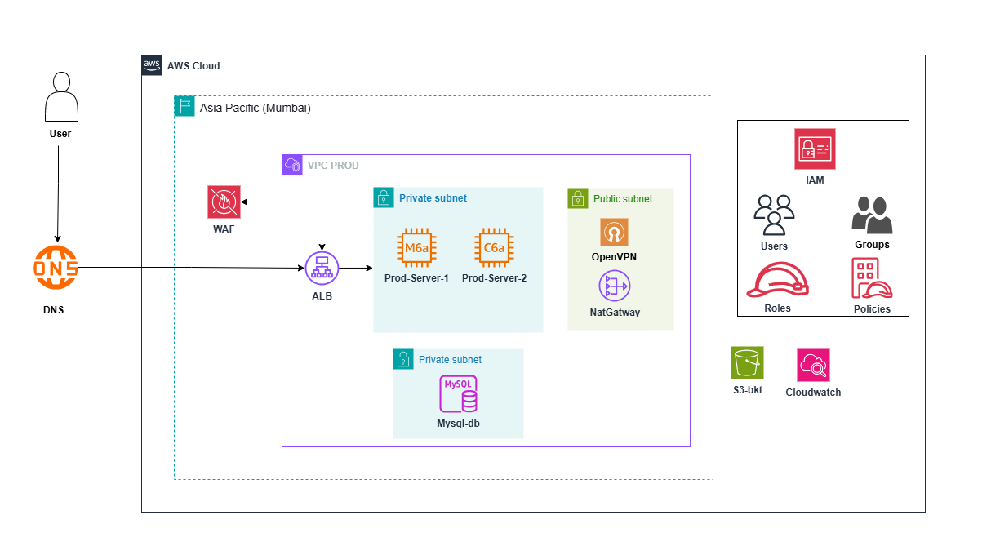

# aws-secure-infra-deployment

# AWS Secure & Highly Available Infrastructure Deployment

## Architecture Diagram

## Overview
This project demonstrates a secure and highly available AWS production architecture deployed in the Mumbai region.

## Key Components
- Route 53 for DNS routing
- AWS WAF for web application security
- Application Load Balancer (ALB)
- VPC with public and private subnets
- EC2 instances in private subnets
- NAT Gateway for outbound internet access
- OpenVPN for secure administrative access
- MySQL database in private subnet
- IAM, S3, and CloudWatch for security, storage, and monitoring

## Security & Availability
- Private subnet isolation for application and database layers
- IAM roles and security groups for least-privilege access
- High availability using ALB and multiple EC2 instances
